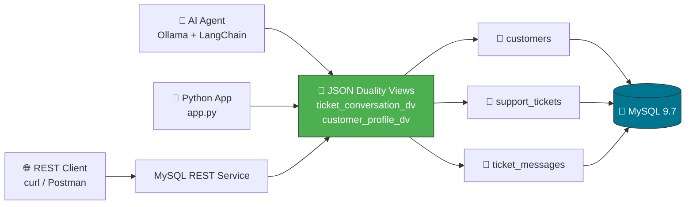
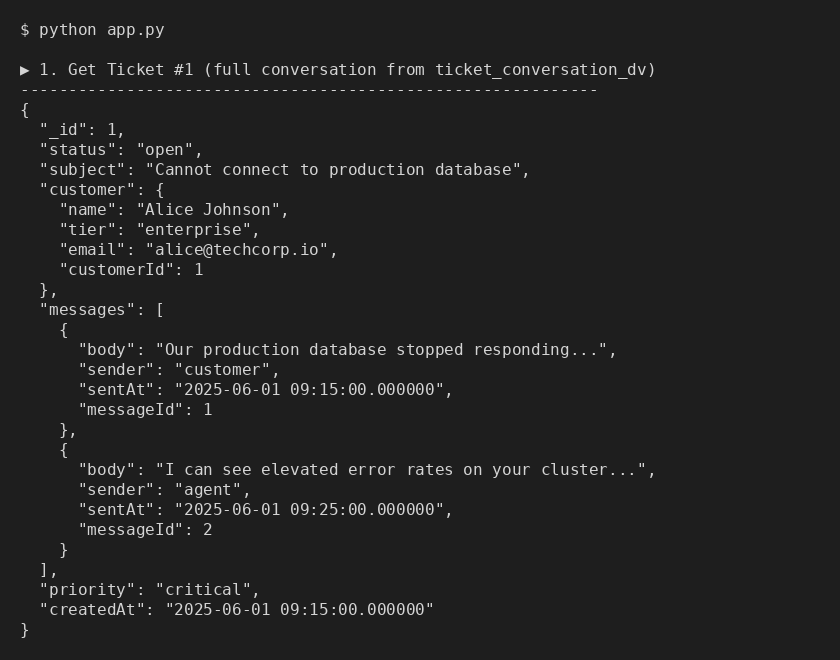
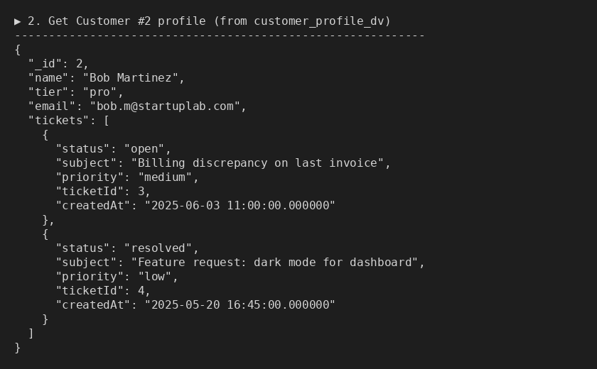
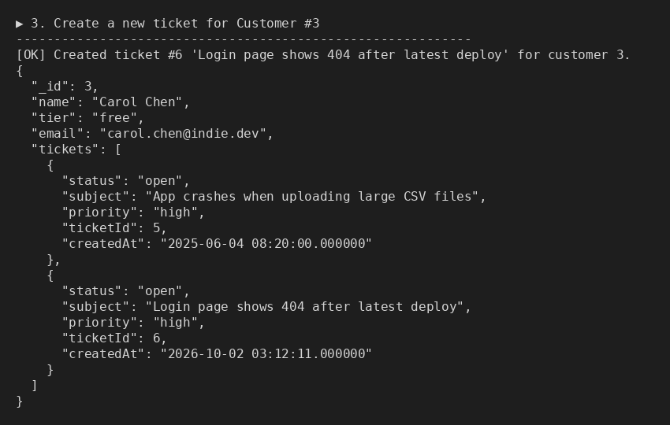
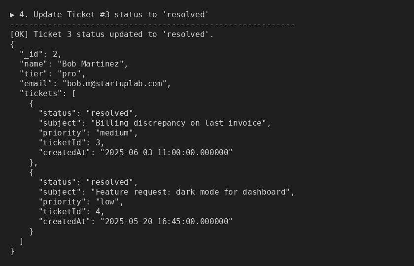
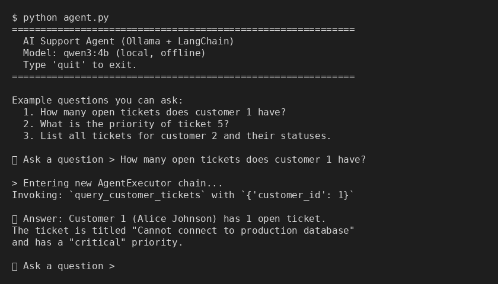

# 🎫 Customer Support Ticket System — MySQL 9.7 JSON Duality Views

> **No More JSON Plumbing** — Build AI-friendly applications where relational tables meet hierarchical JSON, powered by MySQL 9.7 Duality Views.


## 📋 Table of Contents

- [Overview](#overview)
- [Architecture](#architecture)
- [Project Structure](#project-structure)
- [Quick Start](#quick-start)
- [JSON Duality Views Explained](#json-duality-views-explained)
- [Try It — Example Queries](#try-it--example-queries)
- [AI Agent (Bonus)](#ai-agent-bonus)
- [MySQL REST Service (Bonus)](#mysql-rest-service-bonus)
- [Screenshots](#screenshots)
- [Trade-offs & Limitations](#trade-offs--limitations)
- [License](#license)

---

## Overview

Modern AI agents and applications prefer hierarchical JSON documents, but enterprise data lives in normalized relational tables. **JSON Duality Views** in MySQL 9.7 bridge this gap:

- ✅ Relational tables remain the **system of record**
- ✅ Duality Views expose data as **intuitive JSON documents**
- ✅ **Read and write** through JSON — the engine translates to SQL DML
- ✅ No ORM, no mapping layer, no N+1 queries

This project demonstrates a **Customer Support Ticket System** with:
- 3 normalized tables (`customers`, `support_tickets`, `ticket_messages`)
- 2 JSON Duality Views (read-only + updatable)
- A Python application performing CRUD via Duality Views
- A local AI agent using Ollama + LangChain

---

## Architecture



---

## Project Structure

```
json-duality-views-mysql-example/
├── docker-compose.yml      # MySQL 9.7 container (port 3307)
├── schema.sql              # CREATE TABLE statements
├── seed.sql                # Realistic sample data
├── views.sql               # JSON Duality View definitions
├── app.py                  # Python CRUD application
├── agent.py                # AI agent (Ollama + LangChain)
├── requirements.txt        # Python dependencies
├── blog_post.md            # Technical article
├── screenshots/            # Demo screenshots
│   ├── 01_ticket_read.png
│   ├── 02_customer_profile.png
│   ├── 03_create_ticket.png
│   ├── 04_update_status.png
│   └── 05_agent_demo.png
└── README.md               # This file
```

---

## Quick Start

### Prerequisites

- [Docker](https://docs.docker.com/get-docker/) & Docker Compose
- Python 3.10+
- (Optional) [Ollama](https://ollama.ai/) for the AI agent

### 1. Start MySQL 9.7

```bash
# Clone the repository
git clone https://github.com/YOUR_USERNAME/json-duality-views-mysql-example.git
cd json-duality-views-mysql-example

# Start MySQL container
docker compose up -d

# Wait for MySQL to be ready (check logs)
docker compose logs -f mysql
# Look for: "ready for connections"
```

### 2. Set Up Python Environment

```bash
python3 -m venv venv
source venv/bin/activate
pip install -r requirements.txt
```

### 3. Run the Demo Application

```bash
python app.py
```

This will execute all CRUD operations and print formatted JSON output.

### 4. (Optional) Run the AI Agent

```bash
# Install and start Ollama
curl -fsSL https://ollama.ai/install.sh | sh
ollama pull qwen3:4b

# Run the agent
python agent.py
```

---

## JSON Duality Views Explained

### Read-Only View: `ticket_conversation_dv`

Returns a full ticket document with nested customer info and messages:

```json
{
  "_id": 1,
  "subject": "Cannot connect to production database",
  "status": "open",
  "priority": "critical",
  "customer": {
    "_id": 1,
    "name": "Alice Johnson",
    "email": "alice@techcorp.io",
    "tier": "enterprise"
  },
  "messages": [
    {
      "_id": 1,
      "sender": "customer",
      "body": "Our production database stopped responding...",
      "sentAt": "2025-06-01 09:15:00"
    }
  ]
}
```

### Updatable View: `customer_profile_dv`

Supports INSERT, UPDATE, and DELETE through the JSON document:

```json
{
  "_id": 1,
  "name": "Alice Johnson",
  "email": "alice@techcorp.io",
  "tier": "enterprise",
  "tickets": [
    {
      "_id": 1,
      "subject": "Cannot connect to production database",
      "status": "open",
      "priority": "critical"
    }
  ]
}
```

---

## Try It — Example Queries

### 1. Read a Full Ticket Conversation

```sql
SELECT JSON_PRETTY(data)
FROM ticket_conversation_dv
WHERE data->'$._id' = 1;
```

### 2. Get a Customer Profile with All Tickets

```sql
SELECT JSON_PRETTY(data)
FROM customer_profile_dv
WHERE data->'$._id' = 2;
```

### 3. Update a Ticket Status via Duality View

```sql
-- Read-then-write pattern: update status in the JSON document
UPDATE customer_profile_dv
SET data = JSON_SET(data, '$.tickets[0].status', 'resolved')
WHERE data->'$._id' = 1;
```

---

## AI Agent (Bonus)

The `agent.py` file implements a local AI agent using:

- **Ollama** with `qwen3:4b` model (runs offline, no API keys)
- **LangChain** for agent orchestration
- **Custom tools** that query JSON Duality Views

```
🤖 Ask a question > How many open tickets does customer 1 have?

📋 Answer: Customer 1 (Alice Johnson) has 1 open ticket:
   - "Cannot connect to production database" (critical priority)
```

---

## MySQL REST Service (Bonus)

MySQL 9.7 can expose Duality Views as REST endpoints:

```sql
-- Create REST service (requires MySQL REST Service plugin)
CREATE REST SERVICE /support;
CREATE REST SCHEMA /support ON SERVICE /support;
CREATE REST DUALITY VIEW /tickets
    ON SERVICE /support SCHEMA /support
    AS ticket_conversation_dv;
```

Then query via HTTP:

```bash
# Get all tickets
curl http://localhost:8444/support/tickets

# Get a specific ticket
curl http://localhost:8444/support/tickets/1
```

---

## Screenshots

| Operation | Screenshot |
|-----------|------------|
| Read Ticket |  |
| Customer Profile |  |
| Create Ticket |  |
| Update Status |  |
| AI Agent |  |

---

## Trade-offs & Limitations

| Limitation | Detail |
|------------|--------|
| Single-document DML | Cannot update multiple documents in one statement |
| No REPLACE | `REPLACE`, `LOAD DATA`, `INSERT ... ON DUPLICATE KEY UPDATE` not supported |
| WHERE required | Updates require a `WHERE` clause identifying a single row |
| Nested read-only | Nested objects are read-only unless tagged with `WITH(INSERT,UPDATE,DELETE)` |
| Not for OLAP | Not suitable for heavy analytics, batch processing, or complex many-to-many batch ops |
| Optimistic concurrency | Etag-based concurrency adds a read-then-write pattern |
| No EXPLAIN | `EXPLAIN` is not supported on Duality Views |

---

## License

MIT License — See [LICENSE](LICENSE) for details.

---

**Built for the MySQL JSON Duality Views Bounty** 🏆
