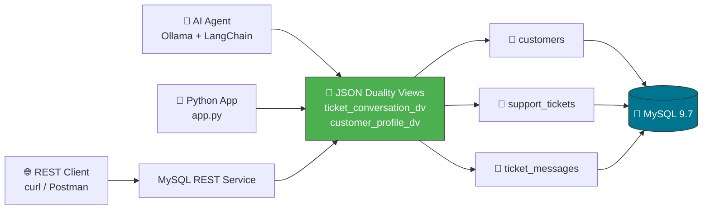

# No More JSON Plumbing: Building AI-Friendly Support Apps with MySQL 9.7 Duality Views

**By Malek | October 2025**

---

## 1. Introduction — The Impedance Mismatch

Every developer building modern applications hits the same wall: **AI agents, REST APIs, and frontend frameworks want hierarchical JSON**, but enterprise data lives in normalized relational tables.

Consider a customer support system. An AI agent answering "What are Alice's open tickets?" expects a single JSON document:

```json
{
  "name": "Alice Johnson",
  "tier": "enterprise",
  "tickets": [
    { "subject": "Cannot connect to production database", "status": "open" }
  ]
}
```

But the data is stored across three normalized tables — `customers`, `support_tickets`, and `ticket_messages` — connected by foreign keys. To serve that JSON, developers traditionally reach for one of three options:

1. **Hand-written SQL + manual JSON assembly** — tedious and error-prone.
2. **ORMs** (SQLAlchemy, Hibernate) — convenient but plagued by N+1 queries, lazy-loading traps, and an entire mapping layer to maintain.
3. **Document databases** — sacrifice referential integrity and transactional guarantees.

**MySQL 9.7 introduces a fourth option: JSON Duality Views.** These views expose relational data as read/write JSON documents. The relational tables remain the system of record, the Duality Views provide the JSON interface, and the database engine handles all the plumbing. No ORM. No manual mapping. No compromises.

In this article, I'll walk through building a complete Customer Support Ticket System that demonstrates this new capability — from schema design to Python application code to a fully local AI agent.

---

## 2. Architecture

The architecture is elegantly simple. Three consumers — a Python application, an AI agent, and REST clients — all interact with the same JSON Duality Views. The views sit on top of normalized relational tables inside MySQL 9.7.



The key insight: **every consumer sees the same JSON document shape**, but the database maintains full relational integrity underneath. A single `INSERT` through a Duality View can generate multiple inserts across base tables. A single `SELECT` returns a fully nested document — no joins needed on the application side.

---

## 3. The Relational Schema — Why Normalized Tables First

Duality Views don't replace relational modeling — they enhance it. We start with three well-normalized tables:

```sql
CREATE TABLE customers (
    customer_id   INT NOT NULL AUTO_INCREMENT PRIMARY KEY,
    name          VARCHAR(120)  NOT NULL,
    email         VARCHAR(255)  NOT NULL UNIQUE,
    tier          ENUM('free','pro','enterprise') NOT NULL DEFAULT 'free'
);

CREATE TABLE support_tickets (
    ticket_id     INT NOT NULL AUTO_INCREMENT PRIMARY KEY,
    customer_id   INT NOT NULL,
    subject       VARCHAR(300)  NOT NULL,
    status        ENUM('open','in_progress','resolved','closed') NOT NULL DEFAULT 'open',
    priority      ENUM('low','medium','high','critical') NOT NULL DEFAULT 'medium',
    created_at    TIMESTAMP NOT NULL DEFAULT CURRENT_TIMESTAMP,
    FOREIGN KEY (customer_id) REFERENCES customers(customer_id) ON DELETE CASCADE
);

CREATE TABLE ticket_messages (
    message_id    INT NOT NULL AUTO_INCREMENT PRIMARY KEY,
    ticket_id     INT NOT NULL,
    sender        ENUM('customer','agent','system') NOT NULL,
    body          TEXT NOT NULL,
    created_at    TIMESTAMP NOT NULL DEFAULT CURRENT_TIMESTAMP,
    FOREIGN KEY (ticket_id) REFERENCES support_tickets(ticket_id) ON DELETE CASCADE
);
```

The relationships are classic one-to-many: one customer has many tickets, one ticket has many messages. Foreign keys with `ON DELETE CASCADE` ensure referential integrity. This is the same schema you'd use with or without Duality Views.

The magic happens in the next layer.

---

## 4. Creating Duality Views — SQL Walkthrough

MySQL 9.7 introduces three key constructs for Duality Views:

- **`JSON_DUALITY_OBJECT()`** — Defines the shape of a JSON document from table columns.
- **`JSON_ARRAYAGG()`** — Creates nested arrays for one-to-many relationships.
- **`WITH(INSERT, UPDATE, DELETE)`** — Enables DML operations on the view (without these tags, the view/sub-object is read-only).

### View 1: `ticket_conversation_dv` (Read-Only)

This view presents each ticket as a full document with nested customer info and message history:

```sql
CREATE OR REPLACE JSON DUALITY VIEW ticket_conversation_dv AS
SELECT JSON_DUALITY_OBJECT(
    '_id':        t.ticket_id,
    'subject':    t.subject,
    'status':     t.status,
    'priority':   t.priority,
    'createdAt':  t.created_at,
    'customer':   JSON_DUALITY_OBJECT(
                      '_id':   c.customer_id,
                      'name':  c.name,
                      'email': c.email,
                      'tier':  c.tier
                  ),
    'messages':   (SELECT JSON_ARRAYAGG(JSON_DUALITY_OBJECT(
                      '_id':       m.message_id,
                      'sender':    m.sender,
                      'body':      m.body,
                      'sentAt':    m.created_at
                  ))
                  FROM ticket_messages m
                  WHERE m.ticket_id = t.ticket_id)
)
FROM support_tickets t
JOIN customers c ON c.customer_id = t.customer_id;
```

Notice: **no `WITH` tags anywhere**. This makes the entire view read-only — perfect for reporting, dashboards, and AI agent queries where you need rich documents but don't want accidental writes.

### View 2: `customer_profile_dv` (Updatable)

This view enables full CRUD operations through JSON:

```sql
CREATE OR REPLACE JSON DUALITY VIEW customer_profile_dv AS
SELECT JSON_DUALITY_OBJECT(
    WITH(INSERT, UPDATE, DELETE)
    '_id':     c.customer_id,
    'name':    c.name,
    'email':   c.email,
    'tier':    c.tier,
    'tickets': (SELECT JSON_ARRAYAGG(JSON_DUALITY_OBJECT(
                    WITH(INSERT, UPDATE, DELETE)
                    '_id':       t.ticket_id,
                    'subject':   t.subject,
                    'status':    t.status,
                    'priority':  t.priority,
                    'createdAt': t.created_at
                ))
               FROM support_tickets t
               WHERE t.customer_id = c.customer_id)
)
FROM customers c;
```

The `WITH(INSERT, UPDATE, DELETE)` tags appear on **both** the root object and the nested tickets object. This is critical — without tags on the nested object, tickets would be read-only even if the root is updatable.

A single `UPDATE` on this view can modify customer fields and ticket fields simultaneously. The MySQL engine decomposes the JSON changes into the appropriate DML statements on the underlying tables.

---

## 5. Python Data Access — No ORM Required

The Python application uses `mysql-connector-python` to interact with Duality Views. No SQLAlchemy, no Django ORM, no mapping configuration.

**Reading a ticket (full document):**

```python
def get_ticket(ticket_id: int) -> dict:
    conn = mysql.connector.connect(**DB_CONFIG)
    cursor = conn.cursor()
    cursor.execute(
        "SELECT JSON_PRETTY(data) FROM ticket_conversation_dv "
        "WHERE data->'$._id' = %s",
        (ticket_id,)
    )
    row = cursor.fetchone()
    return json.loads(row[0]) if row else {}
```

One query. One row. A complete hierarchical document with nested customer info and all messages. No N+1 problem. No join assembly.

**Creating a ticket through the Duality View:**

```python
def create_ticket(customer_id, subject, priority="medium"):
    # 1. Read the current customer document
    cursor.execute(
        "SELECT data FROM customer_profile_dv WHERE data->'$._id' = %s",
        (customer_id,)
    )
    doc = json.loads(cursor.fetchone()[0])

    # 2. Append new ticket to the document
    doc["tickets"].append({
        "subject": subject, "status": "open",
        "priority": priority, "createdAt": "2025-06-15 10:00:00"
    })

    # 3. Write the updated document back
    cursor.execute(
        "UPDATE customer_profile_dv SET data = %s WHERE data->'$._id' = %s",
        (json.dumps(doc), customer_id)
    )
    conn.commit()
```

The Duality View engine detects the new ticket in the array and generates an `INSERT` into `support_tickets`. The developer thinks in JSON; the database thinks in relations.

---

## 6. AI Agent Integration — Local Ollama + LangChain

For the AI integration, we use a fully local, offline stack:

- **Ollama** running `qwen3:4b` — no API keys, no cloud dependency
- **LangChain** for agent orchestration with tool-calling

The agent has a `@tool` function that queries the Duality View:

```python
@tool
def query_customer_tickets(customer_id: int) -> str:
    """Query customer support tickets from the JSON Duality View."""
    conn = mysql.connector.connect(**DB_CONFIG)
    cursor = conn.cursor()
    cursor.execute(
        "SELECT JSON_PRETTY(data) FROM customer_profile_dv "
        "WHERE data->'$._id' = %s",
        (customer_id,)
    )
    row = cursor.fetchone()
    return row[0] if row else '{"error": "Not found"}'
```

When a user asks "How many open tickets does customer 1 have?", the LangChain agent:

1. Recognizes it needs customer data → calls `query_customer_tickets(1)`
2. Receives the full JSON document from the Duality View
3. Analyzes the tickets array and counts those with `status: "open"`
4. Returns a natural-language answer

The JSON Duality View is the perfect interface for AI agents. The agent receives a self-contained document — no need to understand table relationships, foreign keys, or SQL joins. The document **is** the context.

---

## 7. ORM Comparison — Why Duality Views Win

Traditional ORMs introduce significant overhead:

| Aspect | ORM (e.g., SQLAlchemy) | JSON Duality Views |
|--------|----------------------|-------------------|
| **Setup** | Model classes, relationship configs, migrations | One `CREATE VIEW` statement |
| **N+1 Queries** | Common trap with lazy loading | Impossible — document is pre-assembled |
| **Query Performance** | Up to 3× slower for nested data | Native engine optimization |
| **Mapping Layer** | Maintained by developer | Maintained by MySQL engine |
| **JSON Serialization** | Manual or library-specific | Built-in via `JSON_PRETTY()` |
| **Write-back** | Per-field ORM save operations | Full document replacement |

Oracle's benchmarks show that Duality Views can deliver **up to 3× query throughput** compared to equivalent ORM-generated queries for nested document retrieval. This is because the database engine optimizes the document assembly internally, eliminating the round-trip overhead of multiple ORM queries.

The developer experience is also dramatically simpler: instead of maintaining model classes, relationship decorators, and migration scripts, you write a single SQL view definition. Changes to the document shape require updating one view, not an entire model layer.

---

## 8. Trade-offs and Limitations

JSON Duality Views are powerful, but they are not a silver bullet. Understanding the limitations is critical for production use.

### What You Cannot Do

- **No multi-document DML**: You cannot update multiple documents in a single statement. Each `UPDATE` or `DELETE` must target exactly one document via a `WHERE` clause.

- **Unsupported SQL statements**: `REPLACE`, `EXPLAIN`, `LOAD DATA`, and `INSERT ... ON DUPLICATE KEY UPDATE` do **not** work with Duality Views.

- **WHERE clause required for writes**: Updates must include a `WHERE` clause that identifies a single root-level row. Bulk updates are not supported.

- **Nested objects are read-only by default**: Unless a nested `JSON_DUALITY_OBJECT` includes `WITH(INSERT, UPDATE, DELETE)` tags, it is strictly read-only. This is by design — it prevents accidental cascading writes.

- **Not suitable for OLAP**: Duality Views are designed for OLTP workloads — transactional reads and writes of individual documents. Heavy analytical queries, batch processing, or complex many-to-many batch operations should use traditional SQL.

- **Optimistic concurrency control**: Duality Views use an etag-based optimistic concurrency model. This means writes follow a **read-then-write pattern**: read the document (getting its etag), modify it, then write it back with the etag. If another session modified the document in between, the write fails and must be retried.

### When These Limitations Matter

The single-document DML restriction is the most impactful. If your application needs to bulk-update thousands of records (e.g., "close all tickets older than 90 days"), you should use traditional SQL on the base tables, not the Duality View. The view is for individual document operations — exactly what AI agents, REST APIs, and interactive UIs need.

---

## 9. When to Use / When NOT to Use

| ✅ Use Duality Views When | ❌ Avoid Duality Views When |
|---------------------------|---------------------------|
| Serving JSON to APIs, AI agents, or frontends | Running complex analytical queries (OLAP) |
| You want CRUD through JSON without an ORM | Bulk-updating thousands of rows at once |
| The data model is hierarchical (parent → children) | Complex many-to-many relationships with batch ops |
| You need consistent JSON shapes across consumers | You need `REPLACE` or `INSERT ... ON DUPLICATE KEY` |
| You want to eliminate N+1 query problems | You need `EXPLAIN` for query optimization |
| Multiple apps need the same document interface | You're doing `LOAD DATA` for ETL pipelines |
| Read-heavy workloads with occasional writes | Write-heavy workloads with high concurrency |

The sweet spot: **applications where the primary consumers think in documents** (AI agents, mobile apps, SPAs, REST APIs) **but the data is fundamentally relational** (transactions, integrity, reporting).

---

## 10. Conclusion

MySQL 9.7 JSON Duality Views represent a genuine paradigm shift in how we bridge the relational-document divide. Instead of choosing between relational integrity and document convenience, we get both — with a single SQL statement.

In this project, we built a complete Customer Support Ticket System that demonstrates:

- **Normalized relational tables** maintaining data integrity
- **Read-only Duality Views** for rich document retrieval
- **Updatable Duality Views** for JSON-based CRUD operations
- **A Python application** performing all operations without any ORM
- **A local AI agent** querying documents through natural language

The elimination of the ORM mapping layer, the built-in JSON assembly, and the native read/write JSON interface make Duality Views an ideal foundation for AI-friendly applications. When your AI agent can query a single endpoint and receive a complete, self-contained JSON document — with no plumbing in between — you've removed an entire class of engineering complexity.

**The code is open source and available on GitHub:** [json-duality-views-mysql-example](https://github.com/YOUR_USERNAME/json-duality-views-mysql-example)

---

*This article was written for the MySQL JSON Duality Views Bounty. All code runs locally with Docker and Python 3.10+. No cloud services or API keys required.*
